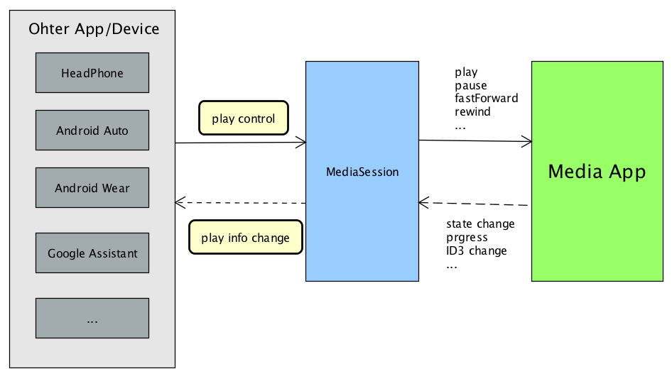

# MediaSession播放框架测试demo
- MusicPlayer 
  - 利用MediaSession播放框架构建的音乐播放器demo，包含：MediaBrowserService、MediaSession同步播放内容与接收播放控制指令、AudioFocus抢占音频焦点、MediaButtonReceiver物理按键处理
- MusicClient： 
  -  MusicPlayer对应的播放内容显示与控制APP。通常车载环境下为蓝牙音乐APP，蓝牙连接成功后用来接收手机端播放内容、展示播放列表、控制手机端音乐APP。

## MusicPlayer
- 播放器端
- 支持播放、暂停、上一首、下一首

### 播放器端接入主要步骤
1. 引入support media 包：com.android.support:support-media-compat:27.1.1
2. Service ->  MediaBrowserServiceCompat
	同时修改清单文件声明 <action android:name="android.media.browse.MediaBrowserService" />

3. 旧的MediaButtonReceiver -> MediaSessionCompat.Callback，
	实现callback中的onPlay、onPause等播放控制方法，需要考虑低版本兼容

4. Init MediaSession
	setPlaybackState(mPlaybackState); setActive(true); setSessionToken

5. Notify PlayInfo
	每次PlayState Change时，重新mSession.setPlaybackState
	每次PlayInfo Change时，重新mSession.setMetadata


## MusicClient
- 远程控制端
- 显示播放器播放内容，播放控制与MusicPlayer Activity
  里面的逻辑重复，暂未实现，可以通过MediaButton测试播放控制
- 车载蓝牙音乐需要将连接的MediaBrowserService替换成
```java 
  // 待连接的服务 
ComponentName componentName = new ComponentName("com.android.bluetooth",
"com.android.bluetooth.a2dpsink.mbs.A2dpMediaBrowserService"); 
```

### Client端接入主要步骤
1. 引入support media 包：com.android.support:support-media-compat:27.1.1

2. MediaBrowser.connect 连接服务

3. MediaBrowser.subscribe(callback) 
	连接成功后，订阅服务端数据，通过callback.onChildrenLoaded接收播放列表改变通知

4. MediaController.registerCallback(callback)
	通过MediaBrowser.getSessionToken()创建MediaController实例，
	1）controller.getTransportControls().play()、pause… 控制播放服务端 
	2）callback.onPlaybackStateChanged、onMetadataChanged 接收当前播放信息改变通知


## MediaButton 模拟物理按键测试
- adb shell input keyevent 87	// next
- adb shell input keyevent 88	// previous
- adb shell input keyevent 126 	// play
- adb shell input keyevent 127	// pause


## 参考文档
- https://juejin.im/post/5aa0e18851882577b45e91df
- https://developer.android.google.cn/training/cars/media
- https://medium.com/androiddevelopers/understanding-mediasession-part-1-3-e4d2725f18e4
- https://github.com/googlesamples/android-UniversalMusicPlayer
- https://android.googlesource.com/platform/packages/apps/Car/Media/

## demo效果
### 播放器端


### Client端


## 原理



